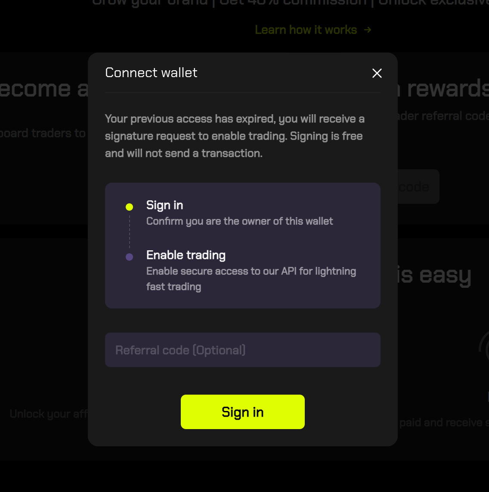
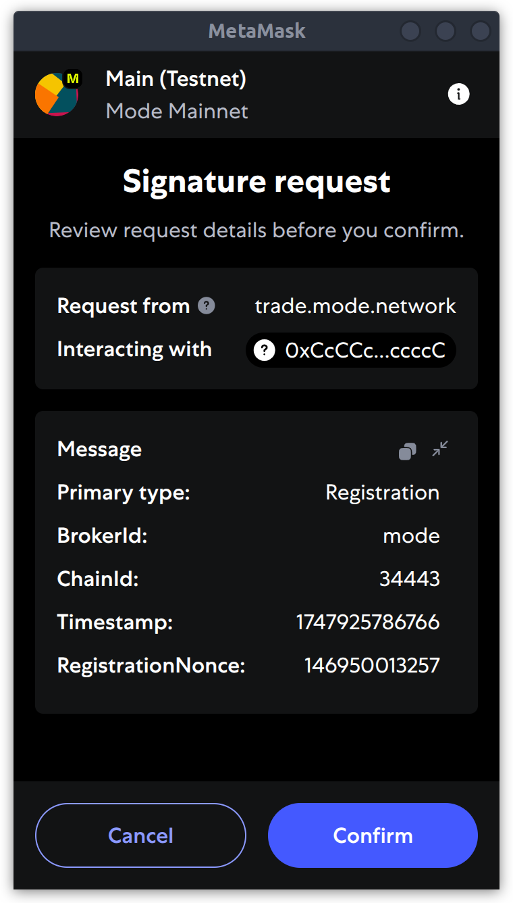
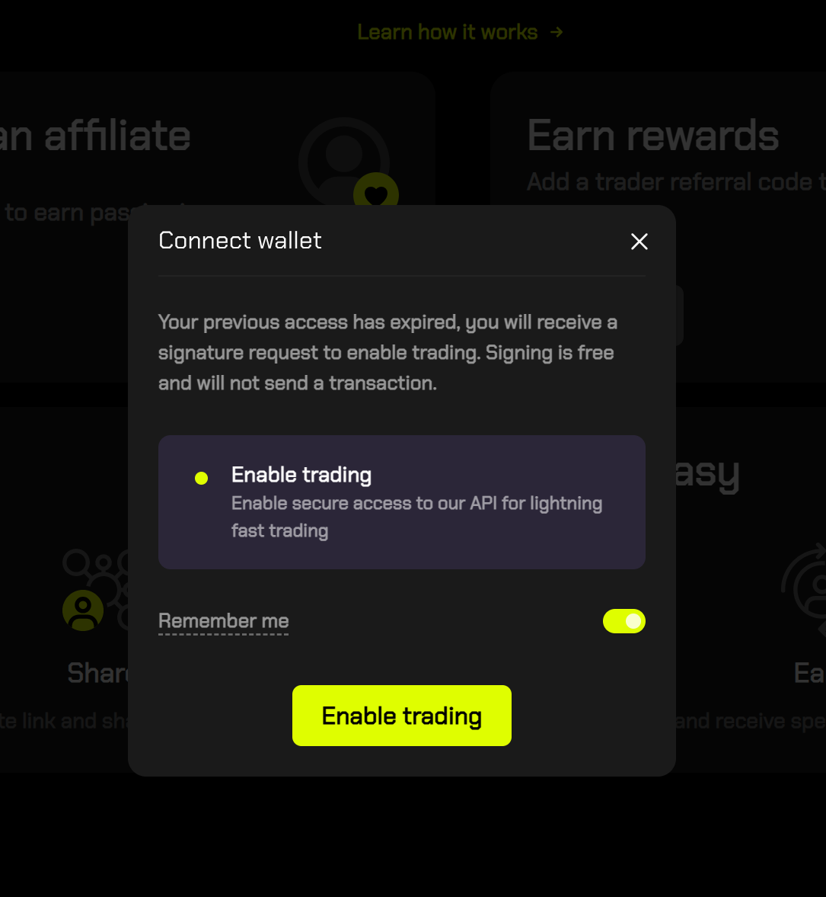
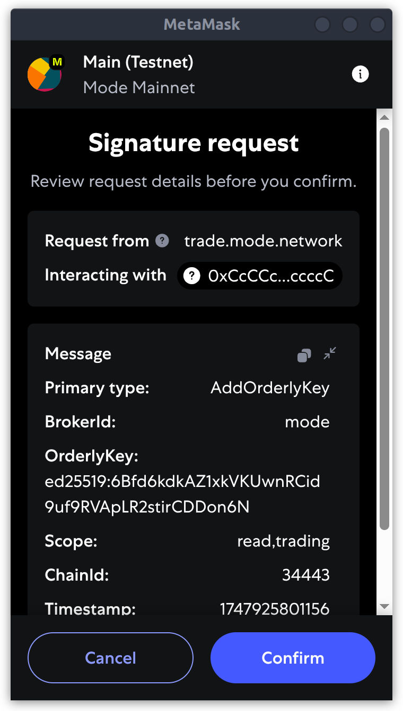
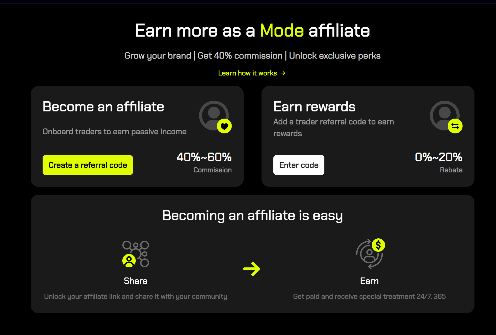
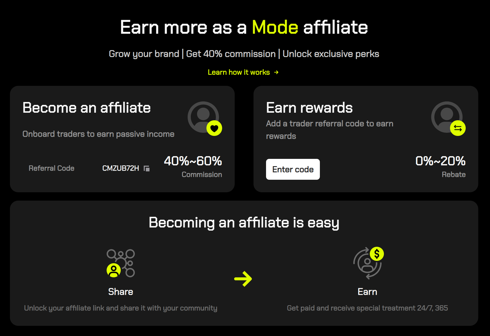
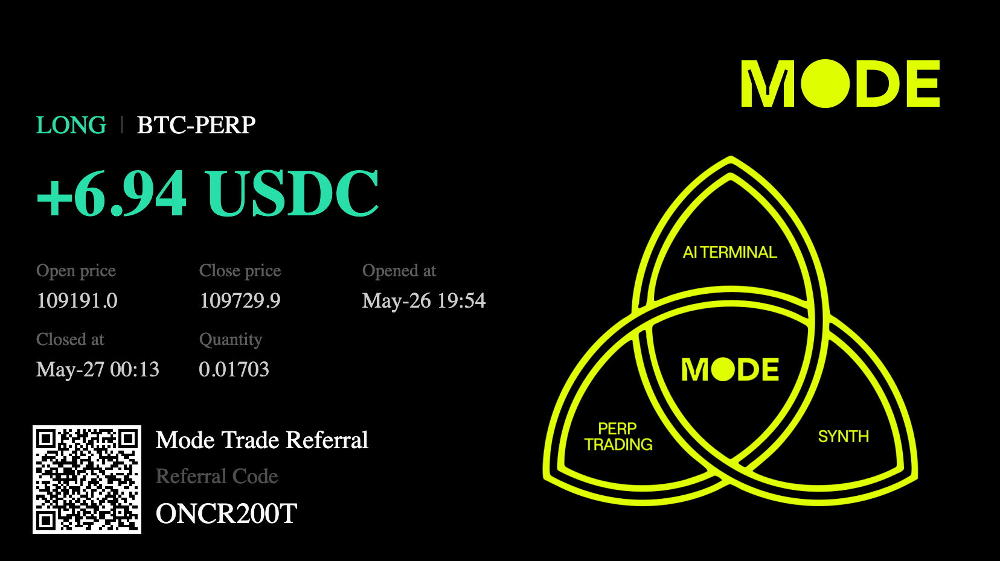

# 💰 Affiliate Program

Turn your Mode Trade experience into real rewards! As a Mode Trade user, you can easily become an affiliate by creating and sharing your unique referral code. Every time someone signs up and trades using your code, you’ll earn over 40% commission.

## How does it work?

It’s simple: create your code, share it with your network, and watch your rewards grow as you help others discover a new ear in AI trading with Mode Trade!

## How do I become an affiliate?

Getting started as a Mode Trade affiliate is quick and easy. Just follow these steps:

### 1. Visit the affiliate page

Go to [https://trade.mode.network/affiliate](https://trade.mode.network/affiliate) and connect your wallet.

### 2. Register your account

After connecting your wallet, you’ll be prompted to register. Approve the signing request in your wallet.

    

    

### 3. Enable trading

Next, you’ll be asked to enable trading by confirming the request in your wallet.

    

    

### 4. Create your referral code

Click the **Create referral code** button to generate your unique code.

    

### 5. Copy your referral code

Once your code is created, simply copy it.

    

### 6. Share and earn

Share your referral code with friends and family. When they start using Mode Trade, both you and your referrals will start receiving rewards!

Your affiliate code is also available on PnL cards for social sharing:

    

