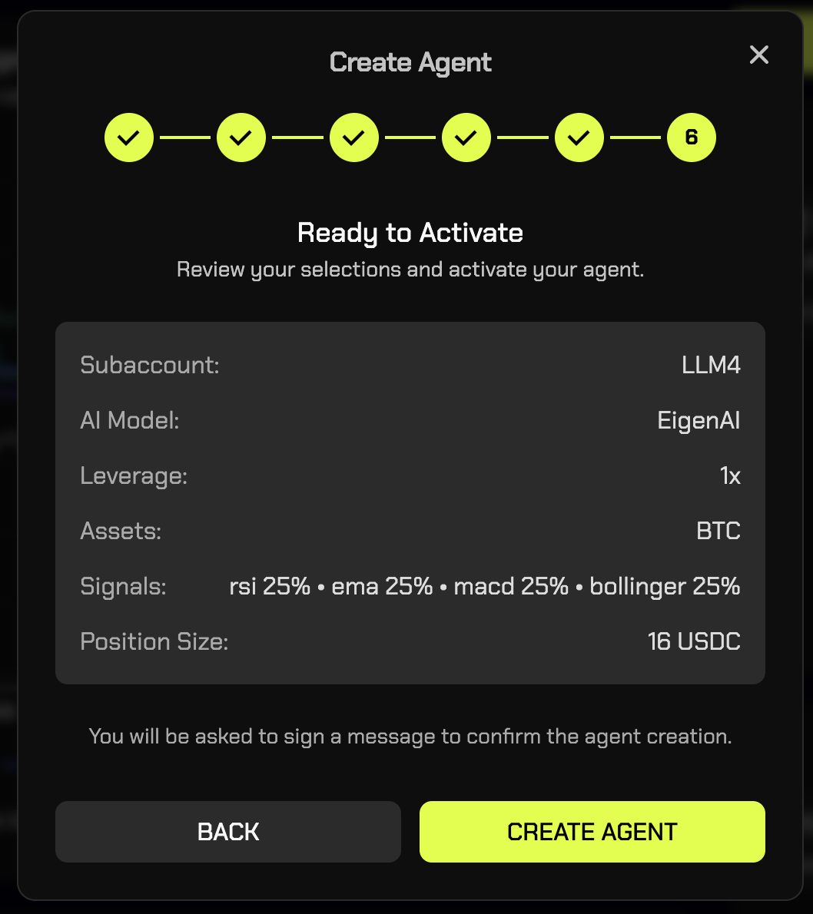
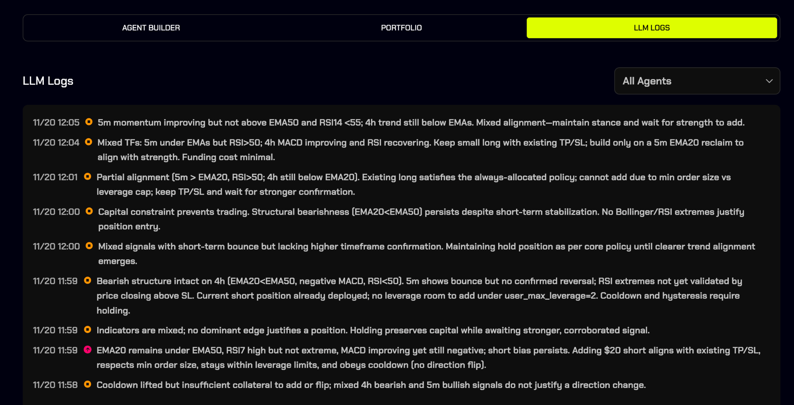

# 🦾 AI Trading Agent

## 1. Introduction

### What Are Mode Trade AI Agents?

Mode Trade AI Agents are automated trading assistants that help you trade more consistently. They handle execution, risk management, and trade monitoring so you don't have to make decisions in the heat of the moment.

Instead of constantly watching the markets or second-guessing your plan, an agent executes according to the rules you set. It helps you avoid emotional trading, manage entries/exits, and stay consistent over time.

### What They Are _Not_

* Agents do **not** guarantee profits.
* Agents are **not** a replacement for learning basic trading principles.
* Agents are **not** immune to market risk — losses are possible and should be expected.

### Why Use Them

* Reduce emotional decisions when trading.
* Maintain consistent execution of your strategy.
* Save time — agents run even when you're offline.
* Learn in a controlled environment with built-in risk limits.

***

## 2. Getting Started

### Step 1 — Create a Sub-Account

Each agent must run in its own sub-account.

* Only **one agent per sub-account**.
* The sub-account must be funded before you launch an agent.

**Example:**\
If you want to test an agent with $50, create a sub-account named "Test Agent," transfer $50, then launch the agent there.

***

## 3. What Are AI Trading Agents?

AI Trading Agents on Mode let you automate crypto trading using advanced LLMs (Large Language Models).

You choose:

* The AI model
* Your sub-account
* Your indicator weights
* Your maximum leverage
* The asset you want to trade

Once activated, the agent trades for you 24/7 using live market data and your chosen strategy configuration.

***

## 4. How AI Agents Work

Every few minutes, the agent:

* Reads live market data and ATR (Average True Range)
* Processes your indicator weights (RSI, EMA, MACD, Bollinger)
* Calculates a directional bias
* Chooses position size based on your max leverage
* Trades only when the signal is strong enough
* Continuously monitors positions with stop-loss & take-profit logic

You can pause or delete the agent at any time.

***

## 5. Creating an Agent (Step-by-Step)

Your UI provides a 6-step creation flow. Here is the full guide:

***

### **Step 1 — Choose Your AI Model**

Select which LLM will power your agent:

* **GPT-5**
* **EigenAI**
* **Qwen3-Max**
* **DeepSeek-V3**

Each model has its own reasoning style but follows the same trading rules.

***

### **Step 2 — Choose a Sub-Account**

Agents trade from a dedicated sub-account so your funds remain isolated.

You can:

* Use an existing sub-account
* Create a new one

Your current balance is shown so you know how much the agent can trade with.

***

### **Step 3 — Signal Weight Allocation**

Tell the agent how much each indicator should matter.

Indicators:

* **RSI** — momentum (overbought/oversold)
* **EMA** — trend
* **MACD** — trend strength
* **Bollinger Bands** — volatility extremes

Rules:

* All weights must total **100%**.
* Adjust using sliders or tap **Reset All to 25%**.

These weights control the decision logic each cycle.

***

### **Step 4 — Set Max Leverage**

Choose the maximum leverage the agent may use.\
**Range:** 0.5× → 2×

The agent selects leverage dynamically based on signal strength but will **never exceed your limit**.

The UI shows your approximate position size.

***

### **Step 5 — Choose Your Asset**

Pick one asset for the agent to trade:

* **BTC**
* **ETH** _(coming soon)_
* **SOL** _(coming soon)_
* **PUMP** _(coming soon)_
* **HYPE** _(coming soon)_

One agent trades **one** asset.

***

### **Step 6 — Review & Activate**

You'll see a summary of:

* Sub-account
* AI model
* Max leverage
* Asset
* Indicator weights
* Position size

Press **Create Agent**, then sign the message to activate.\
Your agent is now live.

***

## 6. Viewing Your Agent's Performance

Open the **Portfolio** tab to monitor:

* Portfolio value
* Total PnL
* Realized PnL
* Unrealized PnL
* Open positions
* Closed positions

All metrics update in real time.

***

## 7. Reviewing LLM Logs

Every agent decision is logged. You'll see:

* The AI's reasoning
* Individual signal values
* Why it entered or avoided a trade
* Risk considerations
* Leverage decisions

This gives full transparency and helps you understand how your agent behave.

***

## 8. Best Practices

* Start with **lower leverage** until you're comfortable
* Keep enough USDC in the sub-account for volatility
* Review LLM logs regularly

***

## 9. Pausing or deleting an Agent

You may pause or delete an agent at any time.\
When closed:

* No new positions will be opened
* Trades will not be automatically closed, unless take profit or stop loss are hit

<figure><figcaption></figcaption></figure>

***

## 10. Risks & Important Notes

* Crypto markets are volatile
* Leverage amplifies gains **and** losses
* Past performance does **not** guarantee future results
* AI models do **not** predict the future
* You should always monitor open positions

Mode agents are designed to be cautious, but losses are still possible.

***

## 11. FAQ

### **Can I run multiple agents?**

Yes — one per sub-account.

### **Can I edit an agent after activation?**

No, you can only pause or delete it.

### **Which indicators are used?**

RSI, EMA, MACD, Bollinger Bands — weighted according to your sliders.

### **Does the agent use stop-loss logic?**

Yes. All agents apply logical SL/TP rules where appropriate.

### **How often does the agent trade?**

Agents always have a bias, but will only take trades when multiple indicators agree.

***

## 12. Summary

Mode's AI Trading Agents allow anyone to run a structured, data-driven crypto trading system powered by advanced LLMs — without coding or manual execution.

**You set the rules.**\
**The agent handles the rest.**
