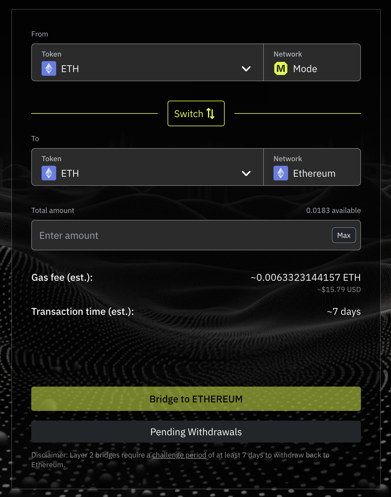

# 📤 Move to/from CEX

Deposit or Withdraw USDC, USDT or ETH between your favorite centralized exchanges and Mode! Jump straight to the instructions -> [here](move-to-from-cex.md#from-cex-to-mode).

## Introduction - Global Addresses

Mode leverages [ZeroDev’s Global Address](https://global-address.zerodev.app/) system to make transferring funds between Mode and centralized exchanges (CEXs) simple and flexible. A global address is a unique, chain-abstracted account that lets you send and receive assets (like USDC, USDT, and ETH) across different chains without the need for traditional bridging.

For Mode users, this means that moving funds to and from CEXs like Binance or Coinbase is seamless. By creating a global address, you can manage your assets across multiple chains as one unified balance, enabling fast and efficient transfers no matter where your assets are held.\
\
You can read [ZeroDev's documentation](https://zerodev.app/) to know more.

## Send funds from CEX to Mode

1. Select your Mode 0x address and paste it into the Receiver Address box on [https://global-address.zerodev.app/](https://global-address.zerodev.app/) and select Mode Mainnet as the Target Chain.\
   \
   Click Create a Global Address.

<figure><figcaption>
Global Address creation
</figcaption></figure>

2.  Visit your favorite centralized exchange (Binance, Bybit, Coinbase, OKX, etc.)

    \
    Select your balance of USDC, USDT or ETH and click Send or Withdraw.\

3.  Choose the cheapest chain to withdraw to between Base, OP Mainnet, Polygon, Arbitrum One, Scroll, and Ethereum.\

    For example, withdrawing from Coinbase to Base is typically free. :wink:\

4. Choose the desired amount and paste **your Global Address you created** in Step 1 as the destination.&#x20;


Before sending your transaction, please double check that:\
\
1\. You are sending supported funds to a supported chain. Check all the combinations [here](https://zerodev.notion.site/ZeroDev-Global-Address-Supported-Tokens-137e616047d18088a11cc84ab56fc5cc).\
\
2\. You are sending the funds to your generated Global Address.\
\
3\. The target chain of the Global Address is pointing to Mode Mainnet\
\
Mistakes can lead to the loss of funds.


<figure><figcaption></figcaption></figure>

5. Click Send and proceed with any additional verification steps required by your exchange.


PRO TIP: \
\
While trying this flow for the first time, it's always recommended to send a small test transaction to make sure everything is working smoothly.


\
Wait a few moments and enjoy your deposit directly to Mode! 💛\

## Send funds from Mode to CEX

1.  Visit your favorite centralized exchange (Binance, Bybit, Coinbase, OKX, etc.)\

    Select your balance of USDC, USDT or ETH and click Receive or Deposit.\

2. Choose the **fastest** chain to receive/deposit from between Base, OP Mainnet, Polygon, Arbitrum One, Scroll, and Ethereum. This will be your Target Chain in the following step.\

3. Select your exchange receiver `0x` address for USDC, USDT or ETH and paste it into the Receiver Address box on [https://global-address.zerodev.app/](https://global-address.zerodev.app/) and select the chain you selected in Step 2 as the Target Chain.

<figure><figcaption>
Global address creation
</figcaption></figure>

4. Open your wallet on Mode.\
   \
   Select your balance of USDC, USDT or ETH and click Send or Withdraw. \

5. Paste your Global Address you created in Step 3 as the destination. You will be sending funds from your wallet on Mode to the global address you just created.


Double check the Target Chain matches the chain your exchange is expecting to receive the deposit from (Step 2).\
\
**Failing to do this can result in loss of funds.**


6. Click Send and proceed with checking and signing the transactions. (Consider sending a test amount.)\
   \
   \
   Wait a few moments and enjoy your deposit directly from Mode! 💛
